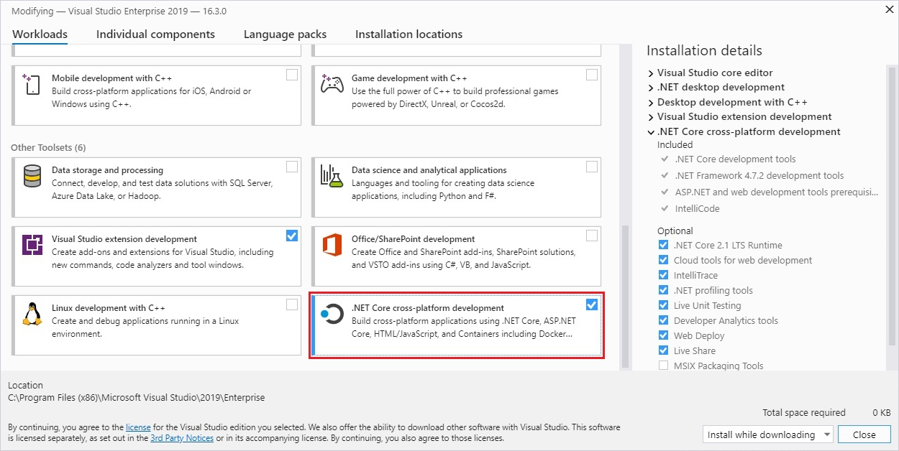

# 00: Введение и обзор основ <span>ASP.NET</span> Core
12/10/2020 | C# 8 | <span>ASP.NET</span> Core 3.1
___
### Содержание
* [Введение](#Введение)
* [Требования к установке](#Требования-к-установке)
    * [SDK и Runtime](#SDK-и-Runtime)
    * [Информация о Runtime](#Информация-о-Runtime)
    * [Информация о SDK](#Информация-о-SDK)
    * [Установка SDK вместе с Visual Studio](#Установка-SDK-вместе-с-Visual-Studio)
    * [Разработка на Linux и macOS](#Разработка-на-Linux-и-macOS)
* [Обзор основ ASP.NET Core](#Обзор-основ-ASP<span>.</span>NET-Core)
    * [Запуск приложения (Host)](#Запуск-приложения-(Host))
    * [Класс Startup](#Класс-Startup)
    * [Внедрение зависимостей (Dependency injection)](#Внедрение-зависимостей-(Dependency-injection))
    * [Промежуточное ПО (Middleware)](#Промежуточное-ПО-(Middleware))
    * [Серверы](#Серверы)
    * [Конфигурация](#Конфигурация)
    * [Среды](#Среды)
    * [Логгирование](#Логгирование)
    * [Маршрутизация](#Маршрутизация)
    * [Обработка ошибок](#Обработка-ошибок)
    * [Создание HTTP запросов](#Создание-HTTP-запросов)
    * [Корневой каталог содержимого](#Корневой-каталог-содержимого)
    * [Корневой веб-каталог](#Корневой-веб-каталог)
* [Полезные ссылки](#Полезные-ссылки)
___
## Введение
Платформа ASP<span>.</span>NET Core является кроссплатформенной, с высокой производительностью и [открытым исходным кодом](https://github.com/dotnet/aspnetcore).

Мы не можем сказать что ASP<span>.</span>NET Core является прямым продолжением развития платформы ASP<span>.</span>NET 5, так как ASP<span>.</span>NET Core содержит большое количество крупных изменений, что выделяет эту платформу как самостоятельную и отдельную от того что было раньше. 

Благодаря модульности фреймворка все необходимые компоненты веб-приложения могут загружаться как отдельные модули через пакетный менеджер Nuget. Кроме того, в отличие от предыдущих версий платформы нет необходимости использовать библиотеку System.Web.dll.

ASP<span>.</span>NET Core включает в себя фреймворк MVC, который объединяет функциональность MVC, Web API и Web Pages. В предыдущих версии платформы данные технологии реализовались отдельно и поэтому содержали много дублирующей функциональности. Сейчас же они объединены в одну программную модель ASP<span>.</span>NET Core MVC. А Web Forms полностью ушли в прошлое.

Также было упрощено управление зависимостями и конфигурирование проекта. Фреймворк теперь имеет свой легковесный контейнер для внедрения зависимостей, и больше нет необходимости применять сторонние контейнеры. А [конфигурирование](https://docs.microsoft.com/ru-ru/aspnet/core/fundamentals/configuration/?view=aspnetcore-3.1) теперь поддерживает облачную систему конфигурации на основе среды.

Для обработки запросов теперь используется упрощенный высокопроизводительный модульный конвейер HTTP-запросов.

### Возможности для развертывания
Благодаря кросс-платформенности платформы .NET Core теперь также возможно запускать веб-приложения на Linux и macOS. А для развертывания (хостинга) можно использовать следующее:
* [Kestrel](https://docs.microsoft.com/en-us/aspnet/core/fundamentals/servers/kestrel?view=aspnetcore-3.1)
* [IIS](https://docs.microsoft.com/en-us/aspnet/core/host-and-deploy/iis/?view=aspnetcore-3.1)
* [HTTP.sys](https://docs.microsoft.com/en-us/aspnet/core/fundamentals/servers/httpsys?view=aspnetcore-3.1)
* [Nginx](https://docs.microsoft.com/en-us/aspnet/core/host-and-deploy/linux-nginx?view=aspnetcore-3.1)
* [Apache](https://docs.microsoft.com/en-us/aspnet/core/host-and-deploy/linux-apache?view=aspnetcore-3.1)
* [Docker](https://docs.microsoft.com/en-us/aspnet/core/host-and-deploy/docker/?view=aspnetcore-3.1)

Если суммировать, то можно выделить следующие ключевые отличия ASP<span>.</span>NET Core от предыдущих версий ASP<span>.</span>NET:
* Упрощенный высокопроизводительный модульный конвейер HTTP-запросов.
* Возможность разработки и запуска в ОС Windows, macOS и Linux.
* Больше возможностей и больший выбор для хостинга.
* Единый стек веб-разработки, сочетающий Web UI и Web API.
* [Razor Pages](https://docs.microsoft.com/en-us/aspnet/core/razor-pages/?view=aspnetcore-3.1&tabs=visual-studio) делает создание кодов сценариев для страниц проще и эффективнее.
* [Blazor](https://docs.microsoft.com/en-us/aspnet/core/blazor/?view=aspnetcore-3.1) позволяет использовать в браузере язык C# вместе с JavaScript. Совместное использование серверной и клиентской логик приложений, написанных с помощью .NET.
* Модульность компонентов и распространение пакетов платформы через NuGet.
* Встроенная поддержка внедрения зависимостей (встроенный контейнер зависимостей).
* Открытый исходный код.

## Требования к установке
### SDK и Runtime
Для работы с платформой .NET Core существует 2 вида установочных пакетов: [SDK](https://docs.microsoft.com/en-us/dotnet/core/install/windows?tabs=netcore31#sdk-information) (набор для разработки ПО) и [Runtime](https://docs.microsoft.com/en-us/dotnet/core/install/windows?tabs=netcore31#runtime-information) (пакет для выполнения программ на этой платформе).

### Информация о Runtime
Runtime, или "среда выполнения", используется для запуска программ созданных для платформы .NET Core. Когда автор публикует приложение, то он может опубликовать среду выполнения вместе с приложением. Однако если среда выполнения не была опубликована, тогда это обязанность пользователя установить её.

Есть три различных вида установочных пакетов которые можно установить на Windows:
* *ASP<span>.</span>NET Core runtime*. Используется для выполнения приложений ASP<span>.</span>NET Core. Включает среду выполнения .NET Core.
* *Desktop runtime*. Используется для запуска классических приложений .NET Core WPF и .NET Core Windows Forms для Windows.
* *.NET Core runtime*. Это самая простая среда выполнения которая не включает остальных (приведенных выше) сред выполнения. Однако, для обеспечения максимального уровня совместимости, рекомендуется устанавливать и *ASP<span>.</span>NET Core runtime* и *Desktop runtime* вместе.

### Информация о SDK
Пакет SDK (Software Development Kit) используется для разработки, построения и публикации .NET Core приложений и библиотек. При установке пакета SDK также устанавливаются все три [среды выполнения](#Информация-о-Runtime): *ASP<span>.</span>NET Core*, *Desktop*, and *.NET Core*.

### Установка SDK вместе с Visual Studio
При разработке на Windows самым популярным и рекомендуемым решением является использование IDE Visual Studio. В настоящее время самый новый и актуальный выпуск этой IDE это [Visual Studio 2019](https://visualstudio.microsoft.com/vs/community/), Community версия доступна бесплатно для использования в некоммерческих целях. Community версия поддерживает все необходимые инструменты для разработки в учебных целях ([подробное сравнение версий](https://visualstudio.microsoft.com/vs/compare/)).

При установке или изменении Visual Studio мы имеем возможность установить соответствующий модуль который установит .NET Core SDK.

Согласно документации на сайте Microsoft, текущая минимальная необходимая версия Visual Studio для работы с .NET Core SDK 3.1 - это VS 16.4 или выше. Ниже приведена таблица соответствия минимальных версий Visual Studio для версий .NET Core SDK ([источник](https://docs.microsoft.com/en-us/dotnet/core/install/windows?tabs=netcore31#install-with-visual-studio)):

Версия .NET Core SDK | Версия Visual Studio
--- | ---
**3.1** | **Visual Studio 2019 версии 16.4 или выше.**
3.0 | Visual Studio 2019 версии 16.3 или выше.
2.2 | Visual Studio 2017 версии 15.9 или выше.
2.1 | Visual Studio 2017 версии 15.7 или выше.

При установке или изменении Visual Studio выберите одну или несколько из следующих рабочих нагрузок в зависимости от типа создаваемого приложения:
1. **.NET Core cross-platform development** (Кроссплатформенная разработка .NET Core) в разделе **Other Toolsets** (Другие наборы инструментов);
1. **ASP<span>.</span>NET and web development** (ASP<span>.</span>NET и разработка веб-приложений) в разделе **Web & Cloud** (Веб-разработка и облако);
1. **Azure development** (Разработка для Azure) в разделе **Web & Cloud** (Веб-разработка и облако);
1. **.NET desktop development** (Разработка классических приложений .NET) в разделе **Desktop & Mobile** (Классические и мобильные).



Для работы с ASP<span>.</span>NET Core необходимым является установка модулей из 1 и 2 пунктов.

### Разработка на Linux и macOS
Поскольку платформа .NET Core является кросс-платформенной, то вы можете разрабатывать свои приложения не только на Windows, но также и на Linux и macOS. Популярным (и рекомендуемым Microsoft) решением является использовать [Visual Studio Code](https://code.visualstudio.com/) - легковесную и кросс-платформенную IDE со встроенной поддержкой Git и большого количества расширений.

Однако Visual Studio Code не является обязательным требованием для разработки на платформе .NET Core на Linux и macOS. Вы можете использовать любой редактор кода по своему вкусу, т.к. после установки SDK вы уже имеете доступ к полному [.NET Core CLI](https://docs.microsoft.com/en-us/dotnet/core/tools/) (интерфейсу командной строки). С помощью терминала и ключевого слова `dotnet` вы имеете доступ к набору комманд для разработки, сборки, запуска и публикации .NET Core приложений.

## Обзор основ ASP<span>.</span>NET Core

Проведём обзор ключевых тем необходимых для понимания и разработки ASP<span>.</span>NET Core приложений.

### Запуск приложения (Host)
Для любого типа проекта ASP<span>.</span>NET Core, как и для проекта консольного приложения, мы имеем класс `Program` определённый в одноимённом файле. В нём определён статический метод `Main()`, который является точкой входа в наше приложение.

Шаблон ASP<span>.</span>NET Core приложения генерирует следующий код внутри класса `Program`:
```cs
public class Program
{
    public static void Main(string[] args)
    {
        CreateHostBuilder(args).Build().Run();
    }

    public static IHostBuilder CreateHostBuilder(string[] args) =>
        Host.CreateDefaultBuilder(args)
            .ConfigureWebHostDefaults(webBuilder =>
            {
                webBuilder.UseStartup<Startup>();
            });
}
```
Для запуска приложения необходим хост объект типа `IHost`, который и создаётся в методе `Main()`. Хост объект инкапсулирует все ресурсы приложения:
* Реализацию HTTP-сервера
* Компоненты промежуточного ПО (middleware)
* Логгирование
* Службы для внедрения зависимостей (dependency injection)
* Конфигурацию

Основная причина включения всех взаимозависимых ресурсов приложения в один объект это управление жизненным циклом: контроль запуска и корректного завершения работы приложения.

При конфигурации создания хоста также указывается класс который будет производить некоторую последующую конфигурацию веб приложения (класс `Startup`).

### Класс Startup
Класс Startup отвечает за:
* Настройку служб необходимых приложению.
* Настройку конвейера обработки запросов, который определён как ряд компонентов промежуточного ПО.

Ниже приведён пример `Startup` класса:
```cs
public class Startup
{
    public void ConfigureServices(IServiceCollection services)
    {
        services.AddRazorPages();
    }

    public void Configure(IApplicationBuilder app, IWebHostEnvironment env)
    {
        if (env.IsDevelopment())
        {
            app.UseDeveloperExceptionPage();
        }

        app.UseRouting();

        app.UseEndpoints(endpoints =>
        {
            endpoints.MapRazorPages();
        });
    }
}
```

### Внедрение зависимостей (Dependency injection)
ASP<span>.</span>NET Core имеет встроенную поддержку внедрение зависимостей которая позволяет получать доступ к сервисам в любом месте приложения.

Настройка и регистрация сервисов происходит в методе `Startup.ConfigureServices()`. Например:
```cs
public void ConfigureServices(IServiceCollection services, IConfiguration configuration)
{
    services.AddControllers();

    services.AddTransient<IMailService, MailService>();

    services.AddTransient<IUserService, UserService>();

    services.AddDbContext<BusinessDbContext>(options =>
                options.UseSqlServer(
                    ConfigurationExtensions.GetConnectionString(
                        configuration, 
                        Constants.DefaultConnectionStringName
                    )
                ));
}
```
Чаще всего внедрение зависимостей происходит через конструктор класса. При внедрении через конструктор, класс объявляет параметры конструктора которые являются требуемым типом (классом или интерфейсом). Встроенная система внедрения зависимостей предоставляет экземпляр нужной зависимости прямо во время выполнения.

Ниже приведён пример внедрения зависимости через конструктор класса:
```cs
public class UsersController : ControllerBase
{
    readonly IUserService _userService;

    public UsersController(IUserService userService)
    {
        _userService = userService;
    }

    // ...

    public async Task<IActionResult> GetAllUsersAsync()
    {
        var users = await _userService.GetAllUsersAsync();
        // ...
    }
}
```
Однако если встроенный контейнер зависимостей не удовлетворяет всем потребностям приложения то всегда можно использовать стороннюю реализацию.

### Промежуточное ПО (Middleware)
Конвейер обработки HTTP запросов состоит из ряда компонентов промежуточного ПО (middleware). Каждый из компонентов проводит операции с передаваемым ему `HttpContext` (контекстом HTTP запроса), а затем либо вызывает следующий middleware конвейера, либо завершает запрос.

По принятому соглашению каждый middleware компонент добавляется в конвейер с помощью вызова метода расширения `Use...()` в `Startup.Configure()`. Например, для включения поддержки протокола веб-сокетов следует вызвать метод расширения `UseWebSockets()`.

Ниже приведён пример настройки конвейера обработки запросов:
```cs
public void Configure(IApplicationBuilder app, IWebHostEnvironment env)
{
    if (env.IsDevelopment())
    {
        app.UseDeveloperExceptionPage();
    }

    app.UseRouting();

    app.UseEndpoints(endpoints =>
    {
        endpoints.MapRazorPages();
    });
}
```
ASP<span>.</span>NET Core [содержит большой набор встроенного middleware](https://docs.microsoft.com/en-us/aspnet/core/fundamentals/middleware/?view=aspnetcore-3.1#built-in-middleware) для обработки запросов. Кроме того, можно создавать собственные пользовательские компоненты middleware.

### Серверы
ASP<span>.</span>NET Core приложение использует реализацию HTTP-сервера для приема HTTP-запросов. Сервер отправляет приложению запросы в виде [набора функций запросов](https://docs.microsoft.com/en-us/aspnet/core/fundamentals/request-features?view=aspnetcore-3.1), которые объеденены в объект типа `HttpContext`. [Серверы для развертывания веб приложения](#Возможности-для-развертывания).

### Конфигурация
ASP<span>.</span>NET Core предоставляет фреймворк конфигурации, которая получает параметры в виде пар "имя-значение" от упорядоченного набора поставщиков конфигурации. Доступны встроенные поставщики конфигурации для различных источников, таких как файлы JSON, XML, переменные среды и аргументы командной строки. Для поддержки других источников можно создать собственные поставщики конфигурации.

[По умолчанию](https://docs.microsoft.com/en-us/aspnet/core/fundamentals/configuration/?view=aspnetcore-3.1#default-configuration) ASP<span>.</span>NET Core приложение настроено считывать файл *appsettings.json*, переменные среды, переменные командной строки и т.д. Когда конфигурация приложения загружена то значения из переменных среды переопределяют значения из *appsettings.json*.

Предпочтительным способом для считывания групп значений конфигурации является использование [паттерна параметров](https://docs.microsoft.com/en-us/aspnet/core/fundamentals/configuration/options?view=aspnetcore-3.1).

Для управления конфиденциальными данными конфигурации, например паролями, ASP<span>.</span>NET Core предоставляет [менеджер секретов](https://docs.microsoft.com/en-us/aspnet/core/security/app-secrets?view=aspnetcore-3.1#secret-manager).

### Среды
Среды выполнения, такие как *Development*, *Staging* и *Production*, являются ключевыми компонентами ASP<span>.</span>NET Core и представляют текущий этап на котором находится приложение (в разработке, подготовка к запуску, развернуто для открытого доступа). Указать среду, в которой запускается приложение, можно с помощью переменной среды *ASPNETCORE_ENVIRONMENT*.

ASP<span>.</span>NET Core считывает переменную среды при запуске приложения и сохраняет ее значение в объекте типа `IWebHostEnvironment`. Этот тип (сервис) доступен в любом месте приложения посредством внедрения зависимостей.

Следующий пример показывает как в конвейер добавляется предоставление подробной информации об исключении, основываясь на значении текущей среды:
```cs
public void Configure(IApplicationBuilder app, IWebHostEnvironment env)
{
    if (env.IsDevelopment()) // Если значение переменной среды ASPNETCORE_ENVIRONMENT == Development
    {
        app.UseDeveloperExceptionPage();
    }
    // ...
}
```

### Логгирование
ASP<span>.</span>NET Core поддерживает API логгирования, которое работает с разными поставщиками (встроенными и сторонними). Доступные следующие поставщики:
* Консоль
* Отладка (Debug)
* Трассировка событий Windows
* Журнал событий Windows
* TraceSource
* Azure App Service
* Azure Application Insights

Подробнее о логгировании читайте [на сайте документации](https://docs.microsoft.com/en-us/aspnet/core/fundamentals/logging/?view=aspnetcore-3.1).

### Маршрутизация
Маршрут это URL паттерн который сопоставляется с обработчиком. Обработчик обычно представляет собой Razor страницу, метод действия (в MVC контроллере), или middleware. ASP<span>.</span>NET Core предоставляет разработчику полный контроль над тем какие URL адреса будут использоватся в его приложении.

### Обработка ошибок
ASP<span>.</span>NET Core имеет следующие встроенные средства для обработки ошибок:
* Страница исключения для разработчика
* Пользовательская страница с ошибкой
* Статические страницы с со статус кодами
* Обработка исключений при запуске

### Создание HTTP запросов
Для создания и выполнения HTTP запросов ASP<span>.</span>NET Core предоставляет тип `IHttpClientFactory` (фабрика HTTP клиентов) которая служит для конфигурации и создания экземпляров типа `HttpClient`, которые и могут подготавливать и выполнять HTTP запросы.

Фабрика HTTP клиентов это:
* Центральное расположение для именования и настройки логических экземпляров `HttpClient`.
* Поддержка регистрации и связывания в цепочки множества делегирующих обработчиков для создания конвейера middleware под исходящие запросы.
* Поддержка интеграции с *Polly* (опулярная сторонняя библиотека для обработки временных сбоев).
* Управление созданием пулов и временем существования базовых экземпляров `HttpClientHandler` с целью избежать обычных проблем с DNS, которые возникают при управлении временем существования `HttpClient` вручную.
* Добавляет настраиваемое логгирование (через `ILogger`) для всех запросов отправленных через клиенты созданные фабрикой.

### Корневой каталог содержимого
Корневой каталог содержимого (Content root) это базовый путь к следующим элементам:
* Исполняемый файл который представляет приложение (*.exe*)
* Скомпилированная сборка которая представляет приложение (*.dll*)
* Файлы содержимого которые используются приложение, такие как:
    * Razor файлы (*.cshtml, .razor*)
    * Файлы конфигурации (*.json*, *.xml*)
    * Файлы данных (*.db*)
* Корневой веб-каталог (обычно это папка с названием *wwwroot*)

Во время разработки content root по умолчанию указывает на корневой каталог проекта. Этот каталог также является базовым путем к файлам содержимого приложения и корневому веб-каталогу. Иной content root может быть настроен [при создании хоста](#Запуск-приложения-(Host)).

### Корневой веб-каталог
Корневой веб-каталог (web root) это базовый путь к статичным файлам ресурсов, таким как:
* Таблицам стилей (*.css*)
* Файлам JavaScript (*.js*)
* Изображениям (*.png, .jpg*)

По умолчанию статические файлы передаются только из корневого веб-каталога и его подкаталогов. По умолчанию путь у корневого веб-каталога такой: *{content root}/wwwroot*. Настроить иной каталог для web root можно [при создании хоста](#Запуск-приложения-(Host)).

Для того чтобы запретить публикацию файлов что находятся в *wwwroot* при публикации приложения следует использовать [элемент \<Content\>](https://docs.microsoft.com/en-us/visualstudio/msbuild/common-msbuild-project-items?view=vs-2019#content) в файле проекта. Следующий пример показывает запрет публикации содержимого в каталоге *wwwroot/local* и его подкаталогах:
```xml
<ItemGroup>
  <Content Update="wwwroot\local\**\*.*" CopyToPublishDirectory="Never" />
</ItemGroup>
```
В Razor *.cshtml* файлах, тильда и слэш (~/) указывают на web root. Путь, начинающийся с ~/, называется *виртуальным путем*.

## Полезные ссылки
* [Install .NET Core on Windows, Linux, and macOS](https://docs.microsoft.com/en-us/dotnet/core/install/)
* [Бесплатно распростраяемые IDE Visual Studio](https://visualstudio.microsoft.com/free-developer-offers/)
* [Введение в ASP.NET Core](https://docs.microsoft.com/en-us/aspnet/core/introduction-to-aspnet-core?view=aspnetcore-3.1)