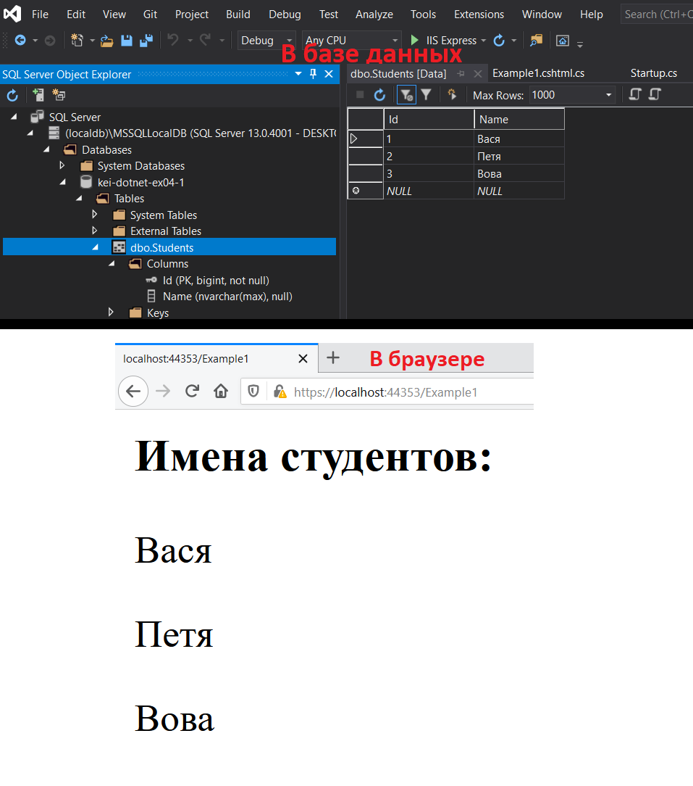
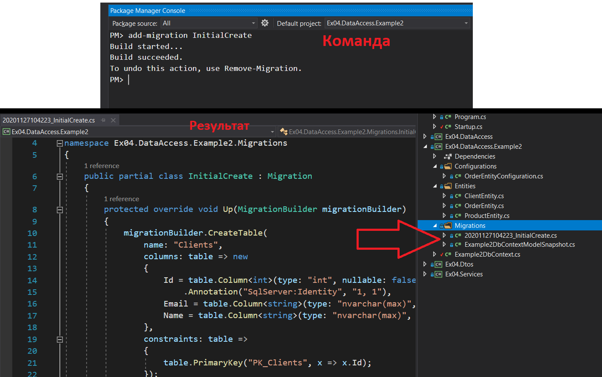
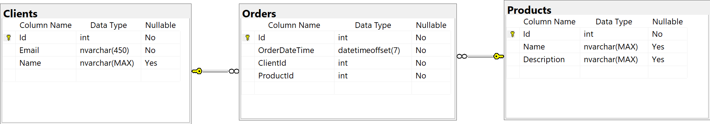
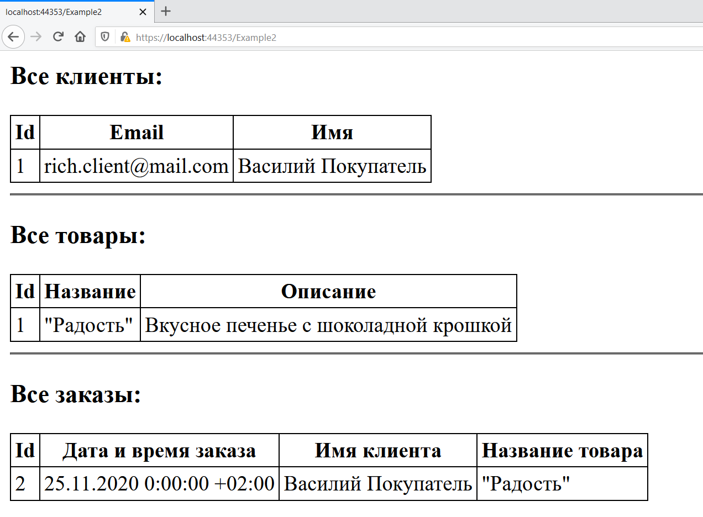
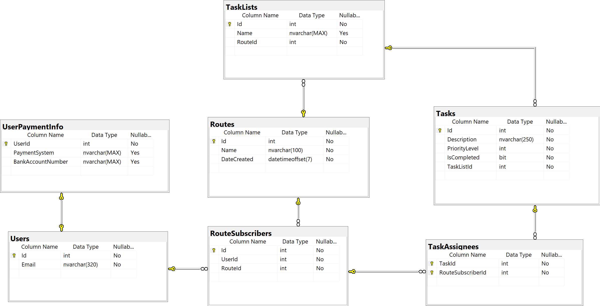
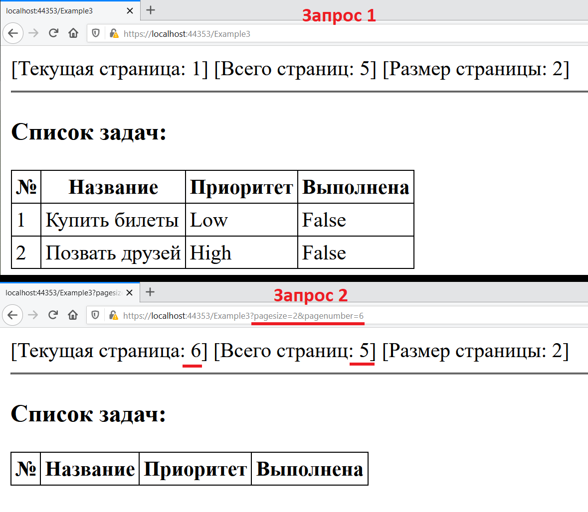
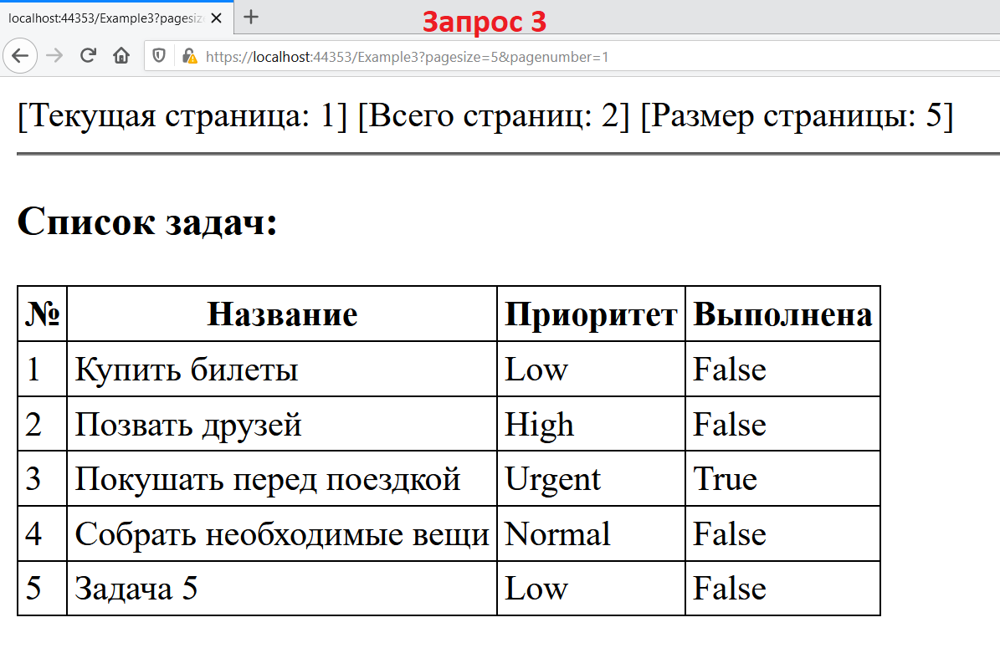

# 04: Взаимодействие с базой данных
25/11/2020 | C# 9 | <span>ASP.NET</span> Core 5
___
### Содержание
* [Введение](#Введение)
* [Самый простой пример](#Самый-простой-пример)
* [Подход "code first" и миграции](#Подход-"code-first"-и-миграции)
* [Пример с пагинацией](#Пример-с-пагинацией)
* [Полезные ссылки](#Полезные-ссылки)
___
## Введение
Доступ к данным является одной из важнейших составляющих для большинства приложений. ASP<span>.</span>NET Core поддерживает широкий спектр способов доступа к данным, включая Entity Framework Core (и Entity Framework 6), и может работать с любыми фреймворками доступа к данным что представлены в .NET. Выбор используемого фреймворка доступа к данным зависит от потребностей приложения. Абстрагирование пользовательского интерфейса и ядра приложения от выбранного способа доступа к данным, и инкапсулирование деталей его реализации в инфраструктуре, позволяет создавать слабо связанное приложение с расширенными возможностями для тестирования.

Если вы создаете новое приложение ASP<span>.</span>NET Core для работы с реляционными БД, то рекомендуемым способом доступа к данным является Entity Framework Core (EF Core). EF Core является объектно-реляционным модулем сопоставления (O/RM), который позволяет .NET разработчикам обеспечивать двустороннюю сохраняемость объектов во взаимодействии с источником данных. Это устраняет необходимость в большей части кода для доступа к данным, который разработчикам обычно приходится писать. EF Core добавляется в приложение как NuGet пакет, настраивается в классе Startup, и внедряется как сервис (с помощью Dependency Injection) там где это необходимо.

Все последующие примеры используют Entity Framework Core для доступа к данным. В качестве СУБД будет использоваться Microsoft SQL Server.

## Самый простой пример
Для использования Entity Framework Core в связке с Microsoft SQL Server мы должны добавить в наш проект пакет `Microsoft.EntityFrameworkCore.SqlServer`.

Теперь определим класс сущности которая будет представлена в БД. Пускай этой будет некая сущность студента:
```cs
namespace Ex04.DataAccess.Example1
{
    public class StudentEntity
    {
        public int Id { get; set; }

        public string Name { get; set; }
    }
}
```
Это обычный класс, который содержит несколько свойств. Каждое свойство будет сопоставляться с отдельным столбцом в таблице из бд. При этом эти свойтсва обязательно должны быть публичными и [авто-свойствами](https://docs.microsoft.com/en-us/dotnet/csharp/programming-guide/classes-and-structs/auto-implemented-properties).

Надо отметить, что Entity Framework Core требует определения ключа элемента для создания первичного ключа в таблице в БД. По умолчанию при генерации БД EF Core в качестве первичных ключей будет рассматривать свойства с именами `Id` или c cуффиксом `[Имя_класса]Id` (то есть получится `StudentId`).

Теперь мы должны создать класс контекста базы данных для данного примера. Для этого наш класс обязательно должен наследовать базовый класс `DbContext` что предоставляется пакетом добавленным в первом шаге:
```cs
namespace Ex04.DataAccess.Example1
{
    public class Example1DbContext : DbContext
    {
        public DbSet<StudentEntity> Students { get; set; }

        public Example1DbContext(DbContextOptions<Example1DbContext> options) 
            : base(options)
        {
            Database.EnsureCreated();
        }

        protected override void OnModelCreating(ModelBuilder modelBuilder)
        {
            modelBuilder.Entity<StudentEntity>().HasData(new StudentEntity[]
            {
                new(){Id = 1, Name = "Вася"},
                new(){Id = 2, Name = "Петя"},
                new(){Id = 3, Name = "Вова"}
            });
        }
    }
}
```
Можно выделить следующие важные типы:
* `DbContext` - определяет контекст данных, используемый для взаимодействия с базой данных.
* `DbSet<TEntity>` - представляет набор объектов, которые хранятся в базе данных.

Для того чтобы мы могли работать с набором данных студентов нам нужно публичное авто-свойство `DbSet<StudentEntity>`. Через это свойство будет осуществляться связь с таблицей объектов Students в самой БД.

В переопределенном методе `OnModelCreating()` добавлена логика добавления начальных данных в БД. А именно, с помощью метода `HasData()`, у типизированного объекта `EntityTypeBuilder<StudentEntity>`, мы определяем начальный набор данных что будет автоматически добавлен в соответствующую таблицу при создании БД.

И также стоит отметить, что по умолчанию у нас нет базы данных. Поэтому в конструкторе класса контекста определен вызов метода `Database.EnsureCreated()`, который при создании контекста автоматически проверит наличие базы данных и, если она отсуствует, создаст ее.

Следующим шагом необходимо зарегистрировать данный класс контекста данных как сервис в нашем веб-приложении с помощью соответствующего метода в классе `Startup`:
```cs
namespace Ex04
{
    public class Startup
    {
        public IConfiguration Configuration { get; }

        public Startup(IConfiguration configuration)
        {
            Configuration = configuration;
        }

        public void ConfigureServices(IServiceCollection services)
        {
            services.AddRazorPages();

            string connectionString1 = Configuration.GetSection("ConnectionStrings")["Example1"];

            services.AddDbContext<Example1DbContext>(options =>
            {
                options.UseSqlServer(connectionString1);
            });
        }

        public void Configure(IApplicationBuilder app)
        {
            app.UseDeveloperExceptionPage();

            app.UseRouting();

            app.UseEndpoints(endpoints =>
            {
                endpoints.MapRazorPages();
            });
        }
    }
}
```
С помощью специального обобщённого метода `AddDbContext<>()` мы добавляем наш класс контекста в коллекцию сервисов, который затем будет доступен для получения с помощью механизма внедрения зависимостей. А метод настройки `UseSqlServer()` принимает строку подключения к БД и конфигурирует контекст на подключение к базе MSSQL. Сама строка подключения к БД вынесена в *appsettings.json*.

Теперь приведём простой пример использования нашего контекста БД. Для этого создадим Razor страницу:
```cs
namespace Ex04.Pages
{
    public class Example1Model : PageModel
    {
        readonly Example1DbContext _dbContext;
        public List<string> StudentsNames { get; set; }

        public Example1Model(Example1DbContext dbContext)
        {
            _dbContext = dbContext;
        }

        public async Task OnGet()
        {
            StudentsNames = await _dbContext
                .Students
                .Select(student => student.Name)
                .ToListAsync();
        }
    }
}
```
В конструкторе класса данной Razor мы получаем экземпляр нашего ранее созданного класса контекста данных, который мы затем используем в методе `OnGet()`. При GET запросе к данной Razor странице мы с помощью LINQ методов получаем список имён всех студентов, который затем присваивается соответствующему свойству `StudentsNames`. Данный список затем выводится на самой странице. Код Razor страницы с логикой вывода данных приведён ниже:
```html+razor
@page
@model Ex04.Pages.Example1Model

@{
    if (Model.StudentsNames.Count == 0)
    {
        <b style="color:red">В базе данных нет имён студентов!</b>
    }

    <h3>Имена студентов:</h3>
    foreach (var studentName in Model.StudentsNames)
    {
        <p>@studentName</p>
    }
}
```
Так, в случае если список не пуст, строки с именами студентов добавляются в разметку страницы.

В итоге имеем простой пример взаимодействия нашего веб-приложения с базой данных. Результат выполнения запроса к данной странице:



## Подход "code first" и миграции
С помощью подхода "code first" (сначала код) разработчик имеет возможность создать хранилище и контекст данных без традиционного проектирования БД вручную, которое традиционно предшествовало написанию кода приложения. При данном подходе разработчик просто создаёт классы моделей и контекста, и пишет логику приложения. А за само создание БД по модели отвечает EF Core. Таким образом код и бизнес-логика приложения выносятся на первый план.

"Code first" прекрасно подходит в случаях если главное в проекте – бизнес логика, а база данных – это лишь способ хранения данных.

Для данного примера создадим простую модель данных состоящую из трёх сущностей: клиент, товар, заказ.


Теперь создадим в нашем веб-проекте новые классы сущностей которые соответствуют сущностям приведённым выше:
```cs
namespace Ex04.DataAccess.Example2.Entities
{
    public class ClientEntity
    {
        public int Id { get; set; }

        public string Email { get; set; }

        public string Name { get; set; }

        public ICollection<OrderEntity> Orders { get; set; }
    }

    public class OrderEntity
    {
        public int Id { get; set; }

        public DateTimeOffset OrderDateTime { get; set; }

        public int ClientId { get; set; }
        public ClientEntity Client  { get; set; }

        public int ProductId { get; set; }
        public ProductEntity Product{ get; set; }
    }

    public class ProductEntity
    {
        public int Id { get; set; }

        public string Name { get; set; }

        public string Description { get; set; }

        public ICollection<OrderEntity> Orders { get; set; }
    }
}
```
Свойства подобные `ICollection<OrderEntity> Orders` являются навигационными свойствами, которые служат для предоставления лёгкого доступа к набору информации для соответствующей сущности, а также для настройки реляционных связей между сущностями.

Теперь необходимо создать новый класс контекста данных в котором будут добавлены все 3 новых класса сущностей:
```cs
namespace Ex04.DataAccess.Example2
{
    public class Example2DbContext : DbContext
    {
        public DbSet<ClientEntity> Clients { get; set; }

        public DbSet<ProductEntity> Products { get; set; }

        public DbSet<OrderEntity> Orders { get; set; }

        public Example2DbContext(DbContextOptions<Example2DbContext> options) 
            : base(options)
        {
            //Database.EnsureCreated();
        }

        protected override void OnModelCreating(ModelBuilder modelBuilder)
        {
            modelBuilder.ApplyConfiguration(new OrderEntityConfiguration());

            modelBuilder.Entity<ClientEntity>()
                .Property(client => client.Email)
                .IsRequired();

            modelBuilder.Entity<ClientEntity>()
                .HasIndex(client => client.Email)
                .IsUnique();
        }
    }
}
```
В отличие от предыдущего примера, в данном примере мы имеем несколько моделей, которые связаны между собой реляционными связями:
* один ко многим: клиент → заказ
* один ко многим: товар → заказ
* многие ко многим ("неявно"): клиент ⟷ товар

При подходе "code first" мы также должны явно указать необходимые нам связи между таблицами. Для этого предназначен виртуальный метод `OnModelCreating()` базового класса `DbContext`, который мы переопределяем и в котором настраиваем наши сущности. Метод `OnModelCreating()` служит для конфигурации модели при её создании, настройки сущностей и связей между ними. Здесь с помощью методов [Fluent API](https://www.entityframeworktutorial.net/efcore/fluent-api-in-entity-framework-core.aspx) и объекта `ModelBuilder` мы настраиваем сущности и их связи.

`ClientEntity` настраивается прямо на месте, в методе `OnModelCreating()`. Так мы настраиваем поле Email для будущей базы данных. Оно должны быть не nullable, индексируемое и уникальное.

Однако у `ModelBuilder` есть метод принимающий экземпляр типа `IEntityTypeConfiguration<TEntity>` в котором настраивается выбранная сущность. Именно так настраивается сущность `OrderEntity`. Здесь, для примера, используются оба способа. Способ с использованием отдельного класса с конфигурацией сущности используется для того чтобы: "не загромождать" класс контекста настройками сущностей, особенно когда их много; для того чтобы инкапсулировать и вынести настройки каждой сущности в отдельный класс.

Настройка сущности OrderEntity с помощью Fluent API приведена ниже:
```cs
namespace Ex04.DataAccess.Example2.Configurations
{
    class OrderEntityConfiguration : IEntityTypeConfiguration<OrderEntity>
    {
        public void Configure(EntityTypeBuilder<OrderEntity> builder)
        {
            builder.HasOne(order => order.Product)
                .WithMany(product => product.Orders)
                .HasForeignKey(order => order.ProductId);

            builder.HasOne(order => order.Client)
                .WithMany(client => client.Orders)
                .HasForeignKey(order => order.ClientId);
        }
    }
}
```
В данном классе с помощью методов Fluent API и определённых ранее навигационных свойств настраиваются реляционные связи `OrderEntity` с другими сущностями по внешним ключам.

Альтернативой Fluent API для настройки сущностей является использование аттрибутов. Однако способ с Fluent API является более предпочтительным. Также использование Fluent API вместо аттрибутов позволяет сохранить классы сущностей "чистыми", без большого объема кода настроек. Кроме того Fluent API позволяет переопределить стандартное сопоставление между классами сущностей и таблицами в базе данных.  

Обратите также внимание на то что по сравнению с предыдущим примером строка `Database.EnsureCreated();` в контексте данных закомментирована. Она больше не нужна т.к. при применении миграций БД будет создаваться с нуля/обновляться автоматически.

Теперь необходимо также зарегистрировать данный контекст данных в коллекции сервисов веб-приложения:
```cs
namespace Ex04
{
    public class Startup
    {
        public IConfiguration Configuration { get; }

        public Startup(IConfiguration configuration)
        {
            Configuration = configuration;
        }

        public void ConfigureServices(IServiceCollection services)
        {
            services.AddRazorPages();

            services.AddDbContext<Example2DbContext>(options =>
            {
                options.UseSqlServer(Configuration["ConnectionStrings:Example2"]);
            });
        }

        public void Configure(IApplicationBuilder app)
        {
            app.UseDeveloperExceptionPage();

            app.UseRouting();

            app.UseEndpoints(endpoints =>
            {
                endpoints.MapRazorPages();
            });
        }
    }
}
```

Теперь, для того чтобы в полной мере использовать преимущества EF Core и подхода "code first", нам нужно использовать [миграции](https://docs.microsoft.com/en-us/ef/core/managing-schemas/migrations).

В реальных проектах модели данных могут изменятся по мере реализации функций, при изменении бизнес-логики и т.д. Поэтому, при добавлении/изменении сущностей или свойств, схема БД также должна изменяться для того чтобы оставаться в соответствии с моделью данных приложения. При этом нужно чтобы все данные должным образом сохранялись при этих изменениях. Всё это возможно благодаря функционалу миграций в EF Core.

**Миграции** в EF Core позволяют инкрементно обновлять схему БД в соответствии с изменённой моделью данных приложения, при этом сохраняя уже имеющиеся в БД данные. В общем миграции работают следующим образом:
* При появлении изменения модели данных разработчик использует средства EF Core, чтобы добавить соответствующую миграцию с описанием обновлений, необходимых для синхронизации схемы базы данных. EF Core сравнивает текущую модель со снимком (snapshot) старой модели для определения различий, и создает исходные файлы миграции. Файлы можно отслеживать в системе управления версиями проекта, как и любые другие исходные файлы.
* Созданную миграцию можно применять к базе данных различными способами. EF Core записывает все примененные миграции в специальную таблицу журнала, из которой видно, какие миграции были применены, а какие нет.

Для использования функционала миграций в нашем примере нужно установить следующие NuGet пакеты:
1. `Microsoft.EntityFrameworkCore.Tools` - добавляется **в проект где расположен класс контекста базы данных**. Пакет добавляет необходимые консольные команды для миграций.
1. `Microsoft.EntityFrameworkCore.Design` - добавляется в startup проект (в данном случае в наше веб-приложение). Пакет добавляет необходимые зависимости для функционала миграций.

Создадим начальную миграцию. С помощью средств Visual Studio 2019 это делается с помощью специальной команды `Add-Migration <migration-name>` в окне "Package Manager Console".



С помощью команды `Update-Database` мы можем применить созданные миграции. В данном случае команда создаст БД с нуля по имеющейся в приложении модели данных. В итоге имеем следующую базу данных:



Теперь добавим простую Razor страницу которая будет использовать данный контекст данных:
```cs
namespace Ex04.Pages
{
    public class Example2Model : PageModel
    {
        readonly Example2DbContext _dbContext;

        public Example2Model(Example2DbContext dbContext)
        {
            _dbContext = dbContext;
        }

        public void OnGet()
        {
            ViewData["clients"] = _dbContext.Clients.AsNoTracking().ToList();
            ViewData["products"] = _dbContext.Products.AsNoTracking().ToList();

            ViewData["orders"] = _dbContext
                .Orders
                .AsNoTracking()
                .Include(order => order.Client)
                .Include(order => order.Product)
                .ToList();
        }
    }
}
```
При GET запросе данная страница получает из БД объекты-коллекции всех клиентов, всех товаров и всех заказов. И сохраняет их в словаре `ViewData`. Затем в представлении в самой странице мы выводим все имеющиеся в коллекциях данные. Код Razor страницы:
```html+razor
@page
@model Ex04.Pages.Example2Model

@{
    var clients = ViewData["clients"] as List<Ex04.DataAccess.Example2.Entities.ClientEntity>;
    var products = ViewData["products"] as List<Ex04.DataAccess.Example2.Entities.ProductEntity>;
    var orders = ViewData["orders"] as List<Ex04.DataAccess.Example2.Entities.OrderEntity>;
}

<h3>Все клиенты:</h3>
<table>
    <tr>
        <th>Id</th>
        <th>Email</th>
        <th>Имя</th>
    </tr>
    @foreach (var client in clients)
    {
        <tr>
            <td>@client.Id</td>
            <td>@client.Email</td>
            <td>@client.Name</td>
        </tr>
    }
</table>

<hr />

<h3>Все товары:</h3>
<table>
    <tr>
        <th>Id</th>
        <th>Название</th>
        <th>Описание</th>
    </tr>
    @foreach (var product in products)
    {
        <tr>
            <td>@product.Id</td>
            <td>@product.Name</td>
            <td>@product.Description</td>
        </tr>
    }
</table>

<hr />

<h3>Все заказы:</h3>
<table>
    <tr>
        <th>Id</th>
        <th>Дата и время заказа</th>
        <th>Имя клиента</th>
        <th>Название товара</th>
    </tr>
    @foreach (var order in orders)
    {
        <tr>
            <td>@order.Id</td>
            <td>@order.OrderDateTime</td>
            <td>@order.Client.Name</td>
            <td>@order.Product.Name</td>
        </tr>
    }
</table>
```

Предварительно добавив вручную по 1 записи в каждую из таблиц, сделаем запрос к данной странице:



## Пример с пагинацией
Данный пример иллюстрирует более сложный практический пример с большим количеством сущностей, а также с получением данных с использованием пагинации.

Имеем следующую базу данных:



Данная БД была сформирована EF Core по следующему классу контекста данных:
```cs
namespace Ex04.DataAccess.Example3
{
    public class Example3DbContext : DbContext
    {
        public DbSet<UserEntity> Users { get; set; }
        public DbSet<UserPaymentInfoEntity> UserPaymentInfo { get; set; }
        public DbSet<TaskEntity> Tasks { get; set; }
        public DbSet<TaskListEntity> TaskLists { get; set; }
        public DbSet<TaskAssigneeEntity> TaskAssignees { get; set; }
        public DbSet<RouteEntity> Routes { get; set; }
        public DbSet<RouteSubscriberEntity> RouteSubscribers { get; set; }

        public Example3DbContext(DbContextOptions<Example3DbContext> options) 
            : base(options)
        {
            Database.EnsureCreated();
        }

        protected override void OnModelCreating(ModelBuilder modelBuilder)
        {
            modelBuilder.ApplyConfiguration(new RouteEntityConfiguration())
                .ApplyConfiguration(new RouteSubscriberEntityConfiguration())
                .ApplyConfiguration(new TaskAssigneeEntityConfiguration())
                .ApplyConfiguration(new TaskEntityConfiguration())
                .ApplyConfiguration(new TaskListEntityConfiguration())
                .ApplyConfiguration(new UserEntityConfiguration())
                .ApplyConfiguration(new UserPaymentInfoEntityConfiguration());

            modelBuilder.SeedExample3();
        }
    }
}
```
В методе `OnModelCreating()` происходит применение настроек сущностей. А в методе `SeedExample3()` происходит наполнение таблиц БД начальными данными. Код настройки сущности `TaskEntity`, которая и будет использоватся для получения её данных, приведён ниже:
```cs
namespace Ex04.DataAccess.Example3.Configurations
{
    class TaskEntityConfiguration :
        IEntityTypeConfiguration<TaskEntity>
    {
        public void Configure(EntityTypeBuilder<TaskEntity> builder)
        {
            builder.HasKey(t => t.Id);
            builder.Property(t => t.Id)
                .ValueGeneratedOnAdd();

            builder.Property(t => t.Description)
                .IsRequired()
                .HasMaxLength(250);

            builder.Property(t => t.IsCompleted)
                .HasDefaultValue(false);

            builder.Property(t => t.PriorityLevel)
                .HasDefaultValue(TaskPriorityLevel.Low);

            builder.HasOne(t => t.TaskList)
                .WithMany(t => t.Tasks)
                .HasForeignKey(t => t.TaskListId);
        }
    }
}
```
Методы Fluent API позволяют явно и "высокоуровнево" настроить сущность. Так, например, с помощью метода `HasDefaultValue()` указывается значение по-умолчанию для конкретного поля таблицы.

Данная модель данных описывает некоторую вспомогательную систему для планирования путешествий. В системе есть пользователи, которые, условно, могут строить и создавать маршруты, подписываться на них. Для каждого маршрута возможно создавать списки задач к которым можно назначать исполнителей и следить за их статусом выполнения. 

Суть данного примера в том чтобы получать из базы данных все созданные задачи. Однако делать это нужно с использованием пагинации.

Класс Razor страницы которая выводит список задач:
```cs
namespace Ex04.Pages
{
    public class Example3Model : PageModel
    {
        readonly ITaskService _taskService;

        public PagedList<TaskDto> PagedTaskDtos;

        public Example3Model(ITaskService taskService)
        {
            _taskService = taskService;
        }

        public void OnGet(int pageNumber = 1, int pageSize = 2)
        {
            PagedTaskDtos = _taskService.GetAllTasks(pageNumber, pageSize);
        }
    }
}
```
Данный класс имеет зависимость от типа `ITaskService`, который с помощью метода `GetAllTasks()` возвращает все сохранённые в БД задачи. При GET запросе к данной странице вызывается метод сервиса и возвращаемая коллекция задач присваивается полю `PagedTaskDtos`, которое затем используется в представлении. 

Также метод отвечающий за обработку GET запросов принимает аргументы пагинации: `pageNumber` (номер страницы) и `pageSize` (размер страницы). Эти аргументы имеют значения по умолчанию (1 и 2 соответственно). Следовательно, если пользователь не передаст эти query параметры в своём GET запросе, то метод сервиса, отвечающий за получение данных, всё равно получит некоторые значения по умолчанию.

За получение задач отвечает сервис `ITaskService` с методом `GetAllTasks()`. Класс `TaskService` реализует данный интерфейс сервиса:
```cs
namespace Ex04.Services.Implementations
{
    public class TaskService : ITaskService
    {
        readonly Example3DbContext _dbContext;

        readonly IMapper _mapper;

        public TaskService(
            Example3DbContext dbContext,
            IMapper mapper)
        {
            _dbContext = dbContext;
            _mapper = mapper;
        }

        public PagedList<TaskDto> GetAllTasks(int pageNumber, int pageSize)
        {
            if (pageNumber <= 0)
                pageNumber = 1;
            if (pageSize <= 0)
                pageSize = 2;

            var pagedTaskEntities = _dbContext
                .Tasks
                .AsNoTracking()
                .ToMyPagedList(pageNumber, pageSize);

            var pagedTaskDtos = _mapper.Map<PagedList<TaskDto>>(pagedTaskEntities);

            return pagedTaskDtos;
        }
    }
}
```
Метод `GetAllTasks()` выполняет LINQ запрос к БД и возвращает список задач в виде типа `PagedList<TaskDto>`. Обобщённый тип `PagedList<>` является вспомогательным типом-обёрткой пагинации для коллекции элементов (в данном случае коллекции объектов задач): 
```cs
namespace Ex04.Services.Helpers
{
    public class PagedList<T> where T : class
    {
        public IEnumerable<T> Items { get; set; }

        public int CurrentPage { get; set; }

        public int TotalPages { get; set; }

        public int PageSize { get; set; }

        public int TotalItemsCount { get; set; }

        public bool HasPrevious => CurrentPage > 1;

        public bool HasNext => CurrentPage < TotalPages;

        public PagedList() { }

        public PagedList(IEnumerable<T> items, int totalItemsCount, int selectedPageNumber, int pageSize)
        {
            Items = items;
            TotalItemsCount = totalItemsCount;
            PageSize = pageSize;
            CurrentPage = selectedPageNumber;
            TotalPages = pageSize == 0 ?
                selectedPageNumber :
                (int)Math.Ceiling(totalItemsCount / (double)pageSize);
        }
    }
}
```
Кроме самой коллекции элементов он также хранит данные пагинации: номер текущей страницы, общее число страниц, размер страницы, общее количество элементов, а также существуют ли следующая/предыдущая страницы.

Вернёмся к методу сервиса `GetAllTasks()`. Стоит отметить что в LINQ запросе присутствует собственный метод расширения - `ToMyPagedList()`. Именно он и отвечает за то чтобы при получении из БД всех задач учитывались и переданные аргументы пагинации:
```cs
namespace Ex04.Services.Extensions
{
    public static class Extensions
    {
        public static PagedList<T> ToMyPagedList<T>(
            this IQueryable<T> source,
            int pageNumber,
            int pageSize) where T : class
        {
            var items = 
                source.Skip((pageNumber - 1) * pageSize).Take(pageSize).ToList();

            int count = source.Count();

            return new PagedList<T>(items, count, pageNumber, pageSize);
        }
    }
}
```
Аргумент `source` типа `IQueryable<T>` является источником данных, методы которого и позволяют выполнить данный запрос. Получение необходимого количества элементов происходит по следующей логике. С помощью метода `Skip()` указывается числовое количество элементов (записей в БД) которое следует пропустить. А метод `Take()` из начала последовательности возвращает количество элементов равное принимаемому числовому значению, из элементов которые остались после "пропуска" методом `Skip()`. *Количество элементов которое следует пропустить* вычисляется по следующей простой формуле: *(номер запрашиваемой страницы - 1) × размер страницы*.

Почему пагинация важна? Кроме очевидных преимуществ для фронтенда, пагинация также может быть очень полезна и при бэкенд разработке. Она используется в случае если мы хотим как-то ограничить количество данных которые пользователь может получить за один раз. Представьте что объем информации достаточно большой и данных очень много. Объем передаваемой информации напрямую влияет на скорость выполнения запросов, к которой на сегодняшний день очень высокие требования. Поэтому подобное ограничение может положительно повлиять на уровень нагрузки на веб-приложение и на саму БД. Кроме того, пользователь не всегда нуждается в том чтобы загрузить за раз весь объем информации в тысячи записей.

Вернёмся к методу сервиса `GetAllTasks()`. При использовании данного метода LINQ запрос вернёт тип `PagedList<TaskEntity>`. Однако, ради хорошей практики программирования, в примере определён тип `TaskDto`:
```cs
namespace Ex04.Dtos
{
    public record TaskDto(
        int Id,
        string Description,
        TaskPriorityLevel PriorityLevel,
        bool IsCompleted);
}
```
Данный тип является DTO (Data Transfer Object), который предназначен для передачи данных между уровнями приложения (в нашем случае от сервисов к уровню пользовательского представления).

И для автоматического маппинга результирующего объекта из `PagedList<TaskEntity>` в `PagedList<TaskEntity>` используется сервис `IMapper`, а именно его метод `Map()`. Необходимая для работы с этим сервисом настройка включает в себя добавление профилей (явного указания соответствия типов для маппинга), и добавление экземпляра класса в коллекцию сервисов. Она вынесена в следующий метод расширения:
```cs
namespace Ex04.Extensions
{
    static class ConfigureAutoMapperExtension
    {
        public static void ConfigureAutoMapper(this IServiceCollection services)
        {
            var mappingConfig = new MapperConfiguration(mc =>
            {
                mc.CreateMap<TaskEntity, TaskDto>();
                mc.CreateMap< PagedList<TaskEntity>, PagedList<TaskDto> >();
            });

            IMapper mapper = mappingConfig.CreateMapper();

            services.AddSingleton(mapper);
        }
    }
}
```
Данные типы предоставляется NuGet пакетом [AutoMapper](https://www.nuget.org/packages/AutoMapper).

Вся необходимая конфигурация класса `Startup` для данного примера приведена ниже:
```cs
namespace Ex04
{
    public class Startup
    {
        public IConfiguration Configuration { get; }

        public Startup(IConfiguration configuration)
        {
            Configuration = configuration;
        }

        public void ConfigureServices(IServiceCollection services)
        {
            services.AddRazorPages();

            string connectionString3 = Configuration.GetConnectionString("Example3");

            services.AddDbContext<Example3DbContext>(options =>
            {
                options.UseSqlServer(connectionString3);
            });

            services.AddTransient<ITaskService, TaskService>();

            services.ConfigureAutoMapper();
        }

        public void Configure(IApplicationBuilder app)
        {
            app.UseDeveloperExceptionPage();

            app.UseRouting();

            app.UseEndpoints(endpoints =>
            {
                endpoints.MapRazorPages();
            });
        }
    }
}
```

В итоге на Razor странице выводится таблица со списком задач и некоторые данные по пагинации:
```html+razor
@page
@model Ex04.Pages.Example3Model

@{
    <label>[Текущая страница: @Model.PagedTaskDtos.CurrentPage]</label>
    <label>[Всего страниц: @Model.PagedTaskDtos.TotalPages]</label>
    <label>[Размер страницы: @Model.PagedTaskDtos.PageSize]</label>
    <hr />

    <h3>Список задач:</h3>
    <table>
        <tr>
            <th>№</th>
            <th>Название</th>
            <th>Приоритет</th>
            <th>Выполнена</th>
        </tr>
        @foreach (var task in Model.PagedTaskDtos.Items)
        {
            <tr>
                <td>@task.Id</td>
                <td>@task.Description</td>
                <td>@task.PriorityLevel</td>
                <td>@task.IsCompleted</td>
            </tr>
        }
    </table>
}
```

Результаты нескольких запросов с разными query параметрами пагинации:





## Полезные ссылки
* [Fluent API в Entity Framework Core](https://www.entityframeworktutorial.net/efcore/fluent-api-in-entity-framework-core.aspx)
* [Миграции](https://docs.microsoft.com/en-us/ef/core/managing-schemas/migrations)