# 05: Фильтры
03/12/2020 | C# 9 | <span>ASP.NET</span> Core 5
___
### Содержание
* [Введение](#Введение)
* [Как работают фильтры](#Как-работают-фильтры)
* [Типы фильтров](#Типы-фильтров)
* [Фильтры авторизации](#Фильтры-авторизации)
* [Фильтры ресурсов](#Фильтры-ресурсов)
* [Фильтры действий](#Фильтры-действий)
* [Фильтры исключений](#Фильтры-исключений)
* [Фильтры результатов](#Фильтры-результатов)
* [Полезные ссылки](#Полезные-ссылки)
___
## Введение
Фильтры в ASP<span>.</span>NET Core позволяют выполнять код до или после определенных этапов в конвейере обработки запросов.

Предоставляемые платформой фильтры решают следующие задачи:
*	Авторизация (предотвращают несанкционированный доступ к ресурсам).
*	Кэширование ответов (прерывание обработки запроса конвейером для возврата кэшированного ответа).

Разработчик также имеет возможность создавать собственные фильтры. Фильтры позволяют избегать дублирования кода. Например, можно объединить обработку ошибок с помощью фильтра исключений.

## Как работают фильтры
Ранее мы уже [упоминали](../../Ex01/about.md#Порядок-добавления-middleware-компонентов-в-конвейер) фильтры в контексте обзора конвейера обработки запросов. Фильтры работают в *конвейере фильтров*, который приступает к работе после того как того ASP<span>.</span>NET Core выберет действие для выполнения. На следующей схеме показан конвейер обработки запросов с подробной иллюстрацией позиции фильтров в нём.

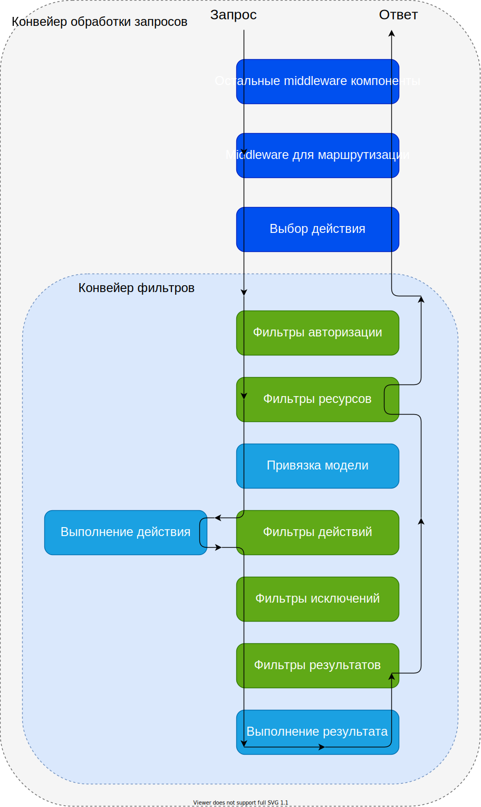

## Типы фильтров
В ASP<span>.</span>NET Core (для приложений MVC) представлено 5 типов фильтров, каждый из которых выполняется на отдельном этапе конвейера фильтров.
*	**Фильтры авторизации** запускаются первыми и определяют авторизован ли пользователь для запроса. Эти фильтры могут прервать последующее выполнение конвейера в случае если запрос не авторизован.
*	**Фильтры ресурсов** выполняются после авторизации. Метод `OnResourceExecuting()` выполняет код до остальной части конвейера фильтров. Например, `OnResourceExecuting()` выполняет код до привязки модели. А метод `OnResourceExecuted()` выполняет код после завершения остальной части конвейера.
*	**Фильтры действий** выполняют код непосредственно до и после вызова метода действия. Могут изменять аргументы, передаваемые в действие. Могут изменять результат, возвращенный действием. Не поддерживаются на Razor страницах.
*	**Фильтры исключений** определяют логику для обработки исключений (до записи данных в тело ответа).
*	**Фильтры результатов** выполняют код сразу до и после выполнения результатов действия. Они выполняются только в случае если метод действия выполнен успешно.

## Фильтры авторизации
Данный тип фильтров выполняется в конвейере первым, до остальных типов фильтров. Фильтры авторизации управляют доступом к методам действия. Как можно заметить [по схеме конвейера фильтров](#Как-работают-фильтры), фильтры авторизации имеют метод "до", но не имеют метода "после". Это значит что с помощью фильтров авторизации у разработчика есть возможность выполнить некоторую логику до остальных фильтров в конвейере, например ограничение доступа к некоторым методам действия.

Для демонстрации данного типа фильтров создадим собственную простую реализацию данного фильтра. Для того чтобы быть фильтром авторизации, класс должен реализовывать интерфейс `IAuthorizationFilter` и соответствующий метод `OnAuthorization()`:
```cs
namespace Ex05.MyFilters
{
    public class MyAuthorizationFilter : Attribute, IAuthorizationFilter
    {
        public void OnAuthorization(AuthorizationFilterContext context)
        {
            bool headerContainsKey = context.HttpContext.Request.Headers.ContainsKey("let-me-in");

            if (!headerContainsKey)
            {
                context.Result = new StatusCodeResult(StatusCodes.Status401Unauthorized);
            }
        }
    }
}
```
Данный фильтр определяет простую логику "авторизованности" запросов. В случае если среди заголовков запроса есть ключ `let-me-in` - запрос авторизован и конвейер фильтров может продолжить работу (в т.ч. будет выполнен метод действия), иначе выполнение запроса будет прервано. Для того чтобы прервать последующую обработку запроса в конвейере, следует присвоить свойству `Result` (объекта контекста фильтра) значение типа `IActionResult`. В данном примере результатом будет экземпляр типа `StatusCodeResult` (который реализует `IActionResult`), который позволяет отправить определенный HTTP статусный код клиенту, в данном случае - *401 Unauthorized*.

Для того чтобы применить данный фильтр к определённому методу действия или контроллеру, мы можем добавить наследование от типа `Attribute` и применить наш фильтр как аттрибут:
```cs
namespace Ex05.Controllers
{
    public class Example1Controller : Controller
    {
        [RequireHttps]
        public IActionResult UseBuiltInHttpsFilter()
        {
            return View(viewName: "Example1View", model: "Использование встроенного фильтра авторизации.");
        }

        [MyAuthorizationFilter]
        public IActionResult UseCustomAuthFilter()
        {
            return View(viewName: "Example1View", model: "Использование собственного созданного фильтра авторизации.");
        }
    }
}
```
При запросе к адресу *UseCustomAuthFilter* имеем следующий результат. Без добавления заголовка:

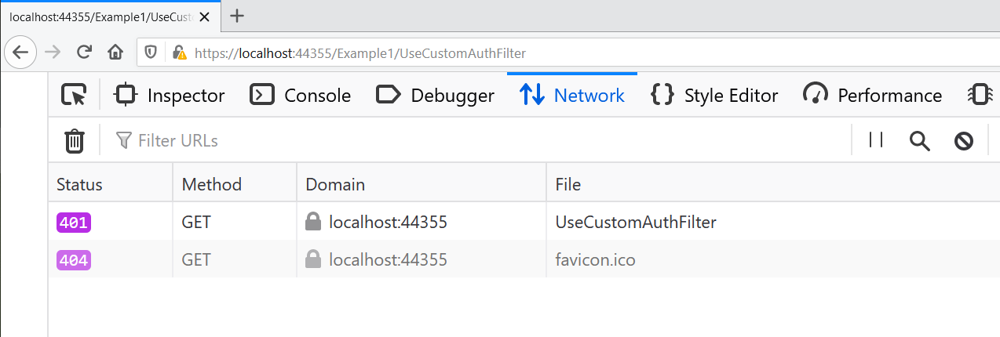

С добавлением заголовка:

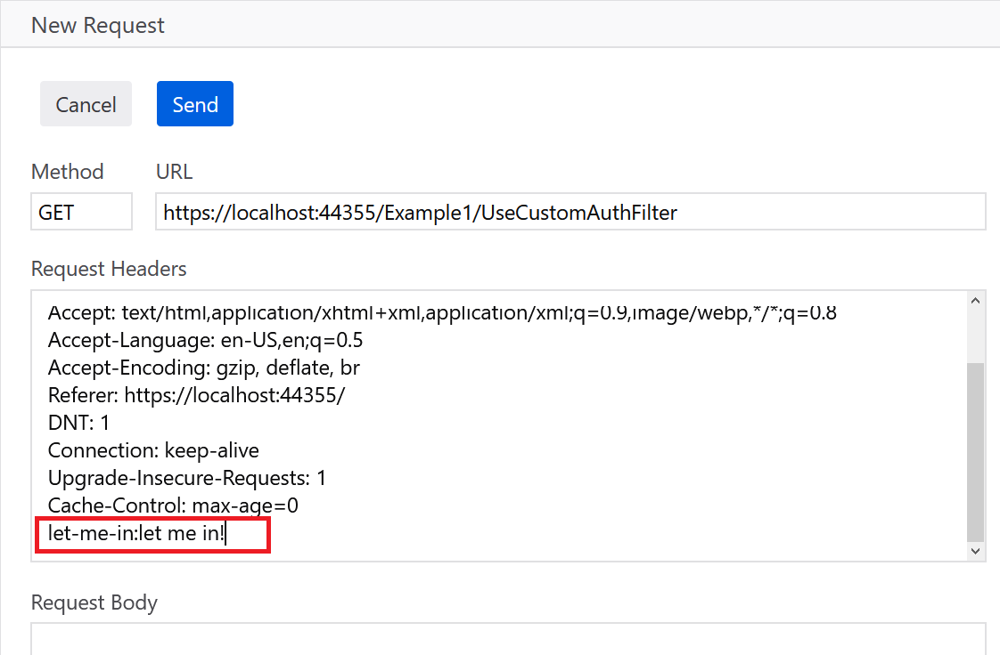

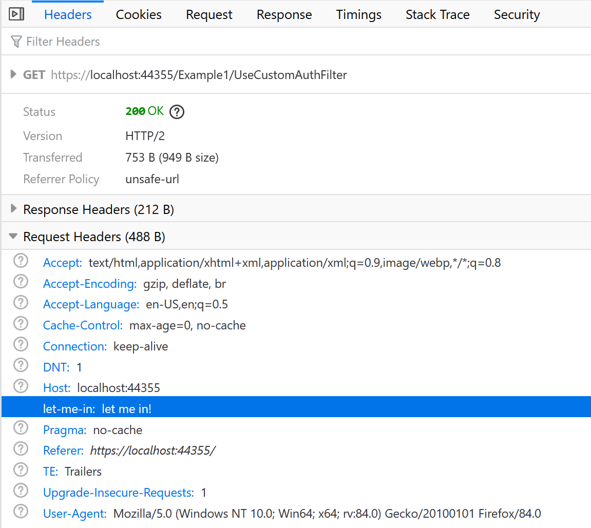

Кроме того платформа ASP<span>.</span>NET Core предоставляет и собственные фильтры авторизации. Например `RequireHttpsAttribute` (который также используется в `Example1Controller`) перенаправляет все запросы HTTP на HTTPS. Например при следующей настройке хостинга
```json
"iisSettings": {
    "iisExpress": {
        "applicationUrl": "http://localhost:52276",
        "sslPort": 44355
    }
}
```
при пользовательском HTTP запросе будет автоматически выполнено перенаправление на HTTPS:

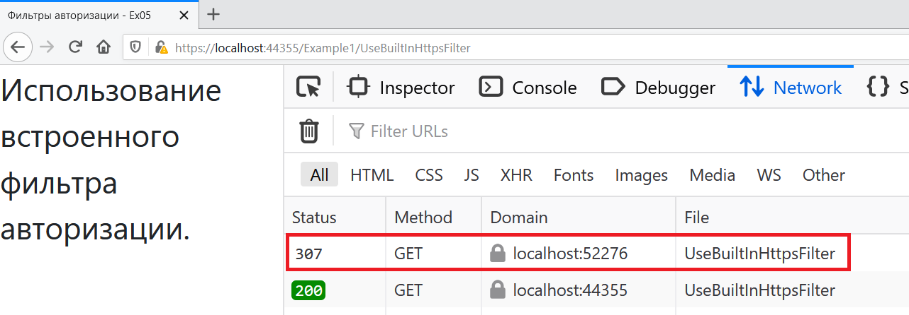

## Фильтры ресурсов
Фильтр ресурсов полезны для короткой обработки запросов. Например, в ситуации с кэшированием: в фильтре ресурсов можно получить кэш и сразу установить результат без ненужной повторной генерации результата в методах контроллера.

Фильтры ресурсов могут выполняться синхронно и асинхронно. Для этого класс фильтра должен реализовывать соответствующий интерфейс, `IResourceFilter` или `IAsyncResourceFilter`.

Для демонстрации работы данного типа фильтра создадим собственный класс который будет реализовывать `IAsyncResourceFilter`:
```cs
namespace Ex05.MyFilters
{
    public class MyResourceFilterAsync : Attribute, IAsyncResourceFilter
    {
        public async Task OnResourceExecutionAsync(
            ResourceExecutingContext context, 
            ResourceExecutionDelegate next)
        {
            string userAgent = context.HttpContext.Request.Headers["User-Agent"].ToString();

            if (Regex.IsMatch(userAgent, "MSIE | Trident"))
            {
                context.Result = new ContentResult
                {
                    Content = "Вы используете устаревший браузер.",
                    StatusCode = StatusCodes.Status400BadRequest
                };
            }

            await next();
        }
    }
}
```
В случае если фильтр будет выполняться синхронно (реализация `IResourceFilter`), то класс фильтра будет иметь следующие 2 метода: `OnResourceExecuting()` - выполняется перед последующими фильтрами (в т.ч. перед выполнением метода действия в контроллере), `OnResourceExecuted()` - выполняется после того как остальная часть конвейера фильтров была выполнена. А в случае если фильтр асинхронный, то в классе будет только 1 метод - `OnResourceExecutionAsync()` в котором, подобно middleware компонентам, одним из аргументов будет делегат, с помощью которого можно вызвать следующий фильтр в конвейере.

Данный фильтр определяет простую логику которая ограничивает доступ к сайту для устаревших браузеров, в данном примере - MS Internet Explorer. По значению заголовка `User-Agent` из запроса определяется браузер клиента. В случае если значение равно *MSIE* или *Trident*, то последующая обработка запроса прекращяется, и пользователь получит сообщение об использовании устаревшего браузера и статус код *400 (плохой запрос)*.

Данный фильтр применён как аттрибут к классу контроллера:
```cs
namespace Ex05.Controllers
{
    [MyResourceFilterAsync]
    public class Example2Controller : Controller
    {
        public IActionResult Action1()
        {
            return View(viewName: "Index", model: "action 1");
        }

        public IActionResult Action2()
        {
            return View(viewName: "Index", model: "action 2");
        }
    }
}
```
При обращении к любому методу действия данного контроллера будет применён данный фильтр. Оба метода контроллера возвращают представление *Index* в котором выводится соответствующая строка:
```html+razor
@model string

@{
    ViewData["Title"] = "Фильтры ресурсов";
}

@Model
```
Результат выполнения запроса к методу действия данного контроллера приведён ниже.

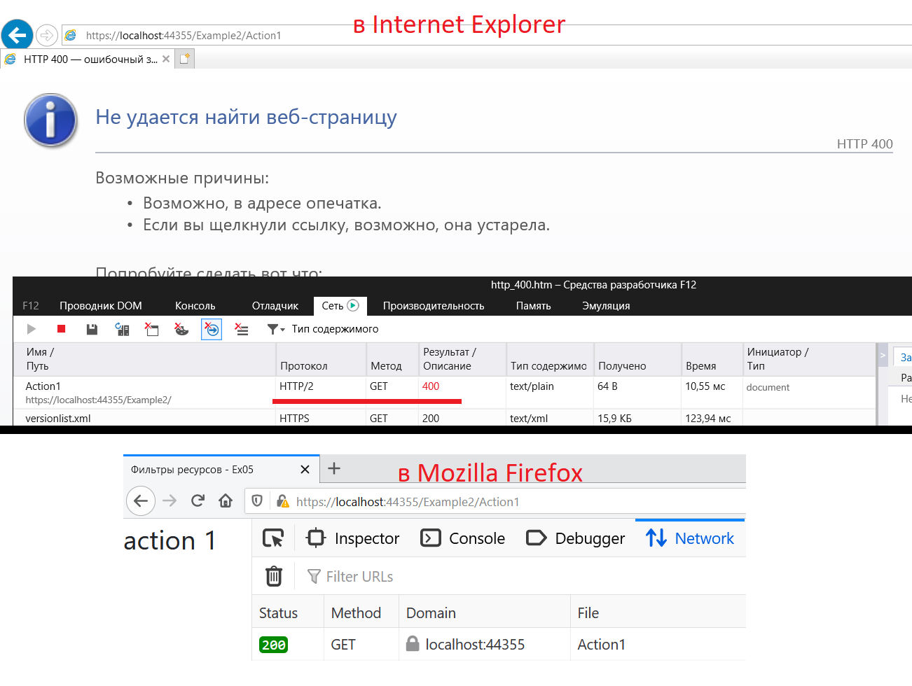

## Фильтры действий
Фильтры действий выполняются после фильтров авторизации и ресурсов. Они позволяют выполнять некоторый код сразу перед и после выполнения метода действия контроллера.

Так как фильтры действий выполняются после привязки модели, то они могут быть использованы для изменения аргументов передаваемых в метод действия. Также они могут манипулировать результатом возвращённым методом действия.

Также, в отличие от MVC и Web API, фильтры действий не доступны для Razor страниц.

Класс фильтра действий должен реализовывать один из интерфейсов: `IActionFilter`, либо `IAsyncActionFilter`. Например:
```cs
namespace Ex05.MyFilters
{
    public class MyActionFilter : Attribute, IActionFilter
    {
        public void OnActionExecuting(ActionExecutingContext context)
        {
            if (!context.ModelState.IsValid)
                context.Result = new BadRequestObjectResult(context.ModelState);
        }

        public void OnActionExecuted(ActionExecutedContext context)
        {
            context.HttpContext.Response.Headers.Add("my-action-filter-name", nameof(MyActionFilter));
        }
    }
}
```
Данный класс имеет 2 метода. `OnActionExecuting()` выполняется до метода действия контроллера. `OnActionExecuted()` выполняется после метода действия контроллера.

Данный фильтр описывает следующую простую логику. В случае если модель не прошла валидацию (свойство `ModelState.IsValid` будет иметь значение `false`), то дальнейшая обработка запроса будет прервана, и результатом запроса будет ответ со статус кодом *400 (плохой запрос)* и JSON объект с описанием ошибок валидации. Таким образом можно использовать фильтры действий для того чтобы вынести проверку валидации модели и избежать повторяемости кода. 

В случае успешной валидации модели, после завершения работы метода действия, в ответ будет добавлен новый заголовок с названием данного класса фильтра. 

Протестируем работу данного фильтра. Применим данный фильтр как аттрибут к методу контроллера:
```cs
namespace Ex05.Controllers
{
    public class Example3Controller : Controller
    {

        public IActionResult SubmitPerson()
        {
            return View();
        }

        [MyActionFilter]
        public IActionResult ViewSubmittedPerson(PersonModel person)
        {
            return View(person);
        }
    }
}
```

Имеем следующую модель и правила её валидации:
```cs
namespace Ex05.Models
{
    public class PersonModel
    {
        [Required(ErrorMessage = "Поле \"Имя\" является обязательным.")]
        [MaxLength(length: 50, ErrorMessage = "Превышена максимально допустимая длина имени.")]
        [Display(Name = "Имя")]
        public string Name { get; set; }

        [Display(Name = "Возраст")]
        [Range(minimum: 18, maximum: 60, ErrorMessage = "Возвраст не входит в ОДЗ.")]
        public int Age { get; set; }

        [Display(Name = "Веган")]
        [ValidateTrue(ErrorMessage = "Данный человек не веган 🥦")]
        public bool IsVegan { get; set; }
    }
}
```

В типизированном представлении *SubmitPerson.cshtml* пользователь должен заполнить форму с полями соответствующими модели `PersonModel`:
```html+razor
@model Ex05.Models.PersonModel
@{ 
    ViewData["Title"] = "Отправка";
}

<h4>PersonModel</h4>
<hr />
<div class="row">
    <div class="col-md-4">
        <form asp-controller="Example3" asp-action="ViewSubmittedPerson">
            <div class="form-group">
                <label asp-for="Name" class="control-label"></label>
                <input asp-for="Name" class="form-control" />
            </div>
            <div class="form-group">
                <label asp-for="Age" class="control-label"></label>
                <input asp-for="Age" class="form-control" />
            </div>
            <div class="form-group form-check">
                @Html.DisplayNameFor(model => model.IsVegan)
                @Html.CheckBoxFor(model => model.IsVegan)
            </div>
            <div class="form-group">
                <input type="submit" value="Отправить" class="btn btn-primary" />
            </div>
        </form>
    </div>
</div>
```
После того как приложение получит от пользователя заполненную форму произойдёт выбор действия и привязка модели. А затем управление перейдёт методу действия `ViewSubmittedPerson()`. Однако к данному методу был применён наш фильтр. Поэтому, по логике определённой в фильтре, если пользователь некорректно заполнил модель - код в методе `ViewSubmittedPerson()` выполняться не будет.

В случае корректного заполнения модели будет выполнен метод действия, и наш фильтр добавит новый заголовок для ответа. Метод действия вернёт представление *ViewSubmittedPerson.cshtml*, которое отвечает за вывод значений объекта модели полученного от пользователя:
```html+razor
@model Ex05.Models.PersonModel
@{ 
    ViewData["Title"] = "Просмотр";
}

<div>
    <h4>PersonModel</h4>
    <hr />
    <dl class="row">
        <dt class = "col-sm-2">
            @Html.DisplayNameFor(model => model.Name)
        </dt>
        <dd class = "col-sm-10">
            @Html.DisplayFor(model => model.Name)
        </dd>
        <dt class = "col-sm-2">
            @Html.DisplayNameFor(model => model.Age)
        </dt>
        <dd class = "col-sm-10">
            @Html.DisplayFor(model => model.Age)
        </dd>
        <dt class = "col-sm-2">
            @Html.DisplayNameFor(model => model.IsVegan)
        </dt>
        <dd class = "col-sm-10">
            @Html.DisplayFor(model => model.IsVegan)
        </dd>
    </dl>
</div>
```

Протестируем работу нашего фильтра и сделаем 2 HTTP запроса.
Пример зароса с некорректными данными для модели:

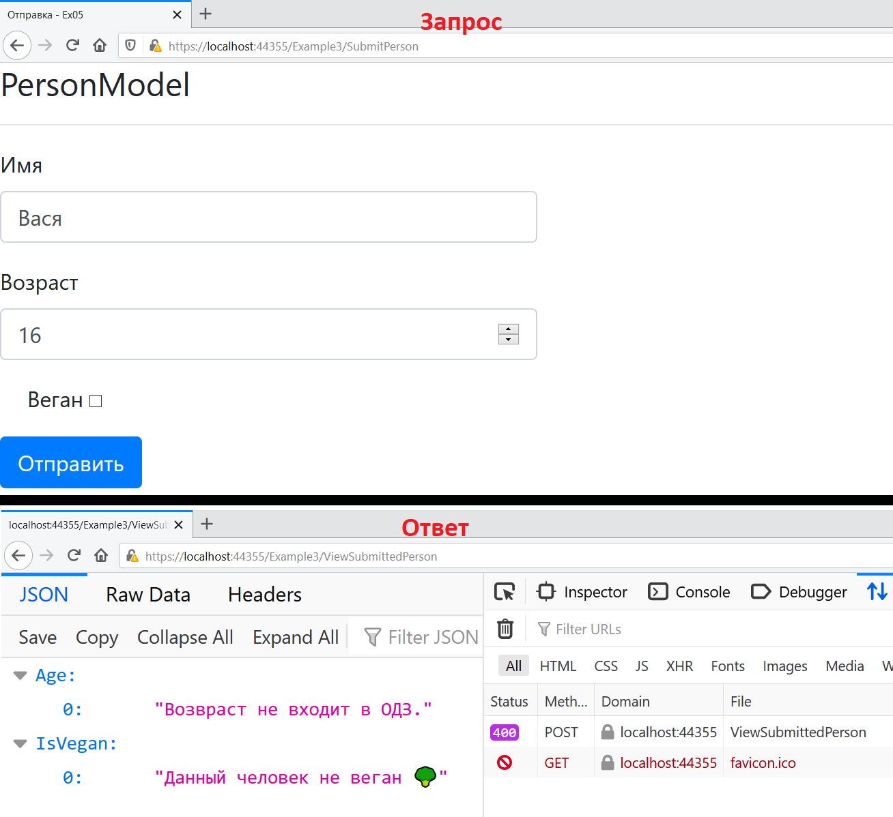

Пример зароса с корректными данными для модели:

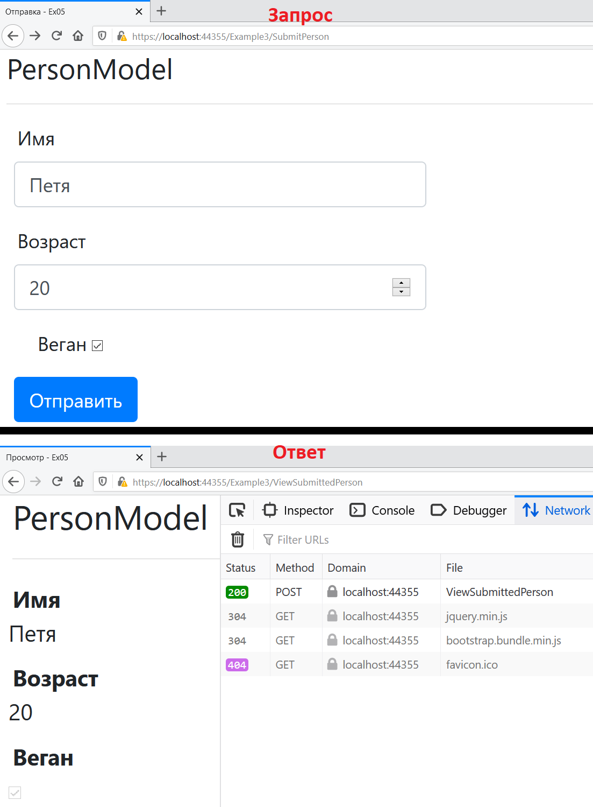

## Фильтры исключений
У фильтров исключений нет событий "до" и "после". Фильтры исключений обрабатывают исключения которые возникают в при создании Razor страницы или объекта контроллера, при привязке модели, при работе фильтров действий и методов действий. Но они НЕ обрабатывают исключения возникающие: в фильтрах ресурсов, в фильтрах результатов, при выполнении результата (result execution).

Фильтры исключений хорошо подходят для обработки исключений которые возникают внутри методов действий. Однако они менее гибки чем middleware компоненты для обработки ошибок.

В общем рекомендуется использовать именно middleware компоненты для обработки исключений. Фильтры исключений следует использовать только когда логика обработки исключения отличается в зависимости от вызываемого метода действия. Например, в приложении могут быть методы действия как для API эндпоинтов, так и для представлений/HTML. API эндпоинты могут возвращать информацию об ошибках в виде JSON объектов, в то время как методы действия с представлениями могут возвращать полноценную HTML страницу с описанием ошибки.

Класс фильтра исключений должен реализовывать `IExceptionFilter` или `IAsyncExceptionFilter`. Также мы можем создать класс фильтра исключений, унаследовав его от абстрактного класса `ExceptionFilterAttribute`. Например:
```cs
namespace Ex05.MyFilters
{
    public class MyExceptionFilter : Attribute, IExceptionFilter
    {
        readonly ILogger _logger;

        public MyExceptionFilter(ILogger<MyExceptionFilter> logger)
        {
            _logger = logger;
        }

        public void OnException(ExceptionContext context)
        {
            string actionName = context.ActionDescriptor.DisplayName;
            string exceptionMessage = context.Exception.Message;

            context.Result = new JsonResult(new
            {
                ExceptionOccured = true,
                ExceptionOccuredAt = actionName,
                ExceptionMessage = exceptionMessage
            });

            _logger.LogInformation($"Exception occured at: {actionName}.\nException message: {exceptionMessage}");

            context.ExceptionHandled = true;
        }
    }
}
```
В методе `OnException()` определяется простая логика для обработки исключения. В результате исключения пользователь получит в ответе JSON объект с информацией о том где произошло исключение (название метода действия) и сообщением. Также эта информация будет записываться в лог. Чтобы исключение считалось обработанным, для свойства `context.ExceptionHandled` устанавливаем значение *true*.

Применим данный фильтр к API контроллеру как аттрибут:
```cs
namespace Ex05.Controllers
{
    [Route("api/[controller]")]
    [ApiController]
    [TypeFilter(typeof(MyExceptionFilter))]
    public class Example4Controller : ControllerBase
    {
        [HttpGet]
        [Route("get-data")]
        public IActionResult GetData()
        {
            throw new Exception("Демонстрация работы фильтра исключений.");

            return new JsonResult(new
            {
                Latitude = "37°37'46.4\"N",
                Longitude = "116°50'58.4\"W",
                IsGeographicalCoordinates = true
            });
        }
    }
}
```
Данный контроллер определяет маршрут *(domain)/api/Example4/get-data*. В методе действия `GetData()`, для демонстрации работы фильтра, с помощью строки `throw new Exception()` явно выбрасывается исключение, которое будет "перехвачено" нашим фильтром.

Обратите внимание что фильтр был применён с использованием вспомогательного аттрибута [`TypeFilterAttribute`](https://docs.microsoft.com/en-us/dotnet/api/microsoft.aspnetcore.mvc.typefilterattribute). Поскольку в нашем фильтре исключений используется сервис для логгирования (экземпляр которого внедряется через конструктор), то для того чтобы применить наш фильтр ему требуется передать его зависимость. За это и отвечает класс `TypeFilterAttribute`. Он будет создавать экземпляр нашего фильтра, передавая в конструктор все необходимые зависимости (сервисы) из тех что доступны в контейнере зависимостей.

Результат запроса к методу действия с исключением приведён ниже:

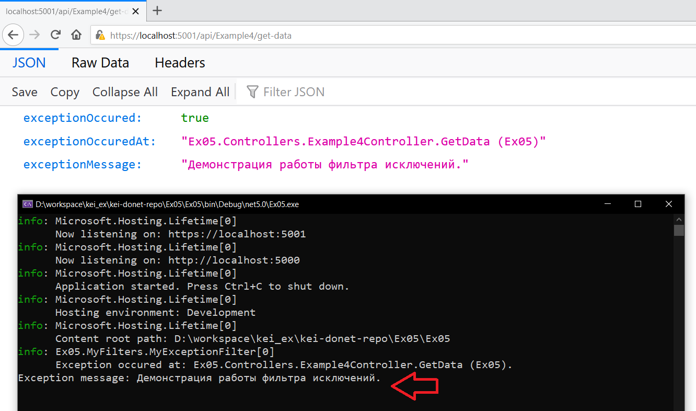

В клиентском браузере получен JSON объект с данными об ошибке. А в консоли приложения (при хостинге приложения на Kestrel) можно увидеть залогированное сообщение об исключении.

## Фильтры результатов
Фильтры результатов выполняются после всех остальных фильтров, а именно до и после выполнения результата действия. Фильтры результатов выполняются только в случае успешного выполнения метода действия. Они полезны для логики которая выполняет какую-то постобработку результата метода, или его форматирования.

Фильтры результатов не вызываются, если фильтры исключений обрабатывают исключение, но не устанавливают свойство `Exception = null`. Также фильтры результатов не вызываются в случае если фильтры исключений обрабатывают исключение и устанавливают новое значение результата действия.

Класс фильтра результатов должен реализовывать `IResultFilter` или `IAsyncResultFilter`, либо наследовать абстрактный класс `ResultFilterAttribute`. 

Для описания логики до выполнения результата действия следует реализовать метод `IResultFilter.OnResultExecuting()`. Соответственно для описания логики после выполнения результата действия используется метод `IResultFilter.OnResultExecuted()`. Метод `IAsyncResultFilter.OnResultExecutionAsync()` позволяет описать эту логику в едином методе, но для асинхронного кода. В случае с наследованием абстрактного класса `ResultFilterAttribute` нам также доступны `OnResultExecuting()` и `OnResultExecuted()`, но они являются виртуальными и их следует переопределять с помощью ключевого слова `override`.

Например:
```cs
namespace Ex05.MyFilters
{
    public class MyResultFilter : ResultFilterAttribute
    {
        public override void OnResultExecuting(ResultExecutingContext context)
        {
            var objResult = context.Result as ObjectResult;
            var list = objResult.Value as List<string>;

            if (list?.FirstOrDefault() is null)
            {
                context.Result = new ContentResult
                {
                    Content = "Список пуст.",
                    StatusCode = StatusCodes.Status404NotFound
                };
            }
        }
    }
}
```
Данный фильтр определяет логику которая, в случае если метод действия в значении объекта результата вернул пустой список, переопределяет результат. В тело ответо будет записана строка с сообщением. И ответ будет иметь статус код 404. 

Также метод `OnResultExecuting()` может прервать выполнение результата действия (execution of action result) и последующее выполнение остальных фильтров результата, установив свойству `ResultExecutingContext.Cancel` значение *true*. В данном случае следует записать что-то в объект ответа чтобы избежать генерации пустого ответа.

К моменту когда выполняется метод `IResultFilter.OnResultExecuted()`, ответ уже, скорее всего, был отправлен клиенту. В данном случае изменить ответ уже нельзя.

Свойство `ResultExecutedContext.Canceled` будет иметь значение *true* если выполнение результата действия уже было прервано другим фильтром.

Применим данный фильтр к API контроллеру:
```cs
namespace Ex05.Controllers
{
    [Route("api/[controller]")]
    [ApiController]
    [MyResultFilter]
    public class Example5Controller : ControllerBase
    {
        [HttpGet]
        [Route("get-list")]
        public List<string> GetList()
        {
            return new();
        }

        [HttpGet]
        [Route("get-list2")]
        public List<string> GetList2()
        {
            return new()
            {
                "🟥 red",
                "🟧 orange",
                "🟨 yellow",
                "🟩 green",
                "🟦 blue",
                "🟪 violet",
                "⬜ white"
            };
        }
    }
}
```
Данный API контроллер определяет 2 эндпоинта:
Эндпоинт | Возвращаемое значение
--- | ---
api/Example5/get-list | Пустой список
api/Example5/get-list2 | Список из 7 строк

Наш фильтр применяется как аттрибут на уровне класса контроллера. Поэтому он будет применён ко всем методам действия данного контроллера.

Результат запроса к эндпоинту с пустым списком:

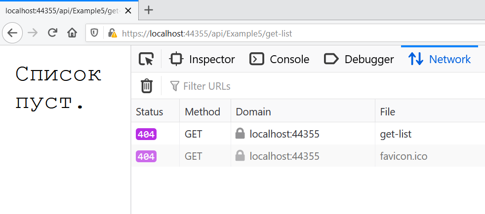

Результат запроса к эндпоинту со списком из 7 строк:

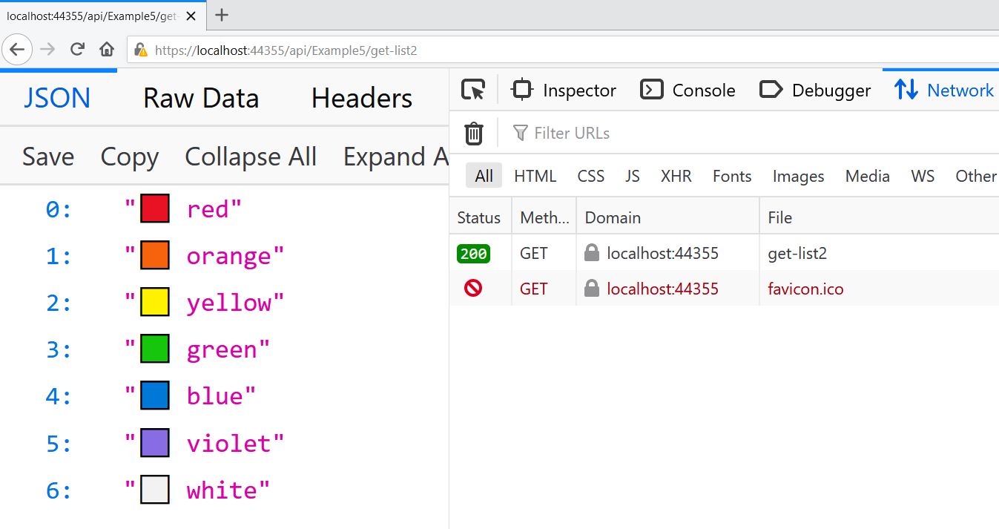

Под "выполнением результата действия" подразумевается выполнение метода [`IActionResult.ExecuteResultAsync()`](https://docs.microsoft.com/ru-ru/dotnet/api/microsoft.aspnetcore.mvc.iactionresult.executeresultasync).

## Полезные ссылки
* [Filters in ASP.NET Core](https://docs.microsoft.com/en-us/aspnet/core/mvc/controllers/filters)